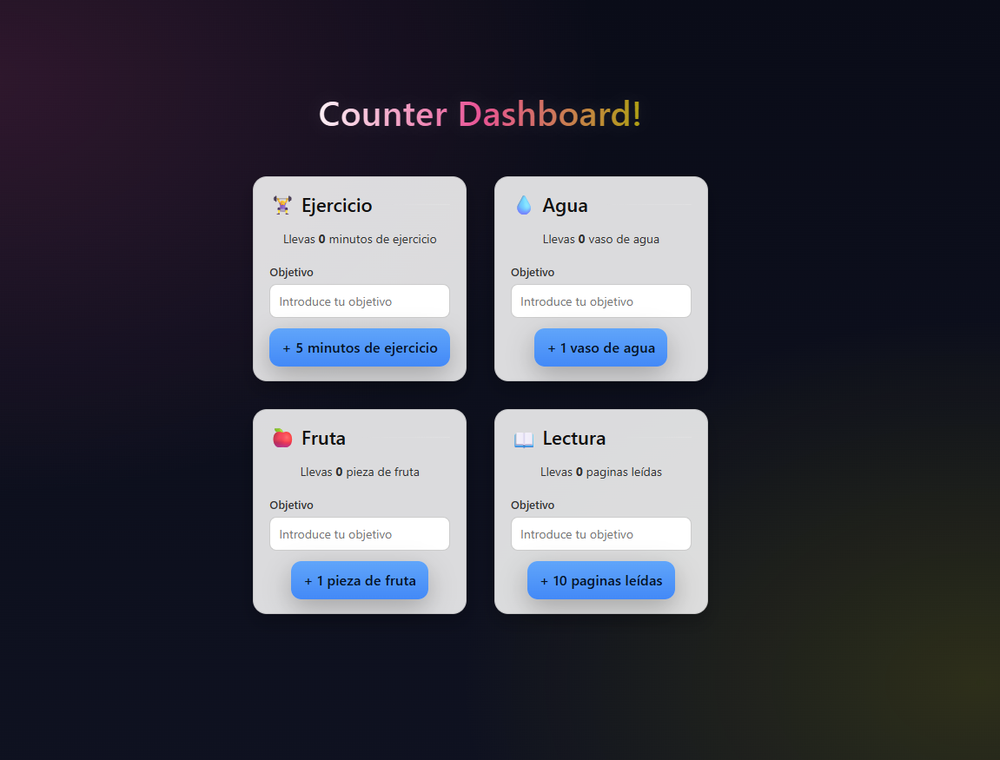

# Habit Tracker 📝

Web application built with **React** to register and track daily habits.

## 🚀 Demo
[View demo on Vercel](https://practica-react-patricia-al-es.vercel.app)

## 🛠 Technologies
- React (Vite)  
- JavaScript (ES6+)  
- CSS  
- LocalStorage  
- Vercel (deployment)  

## ✨ Features
- Add and delete habits  
- Dynamic progress counter  
- Data persistence between sessions (LocalStorage)  
- Simple and responsive UI  

## 📸 Screenshots


## 📂 Project structure
src/
├── components/ # React components
├── App.jsx # Main component
├── main.jsx # Entry point
└── styles/ # CSS styles

nginx
Copiar código

## 🏗️ How to run locally

If you want to run the project on your computer:

1. **Clone the repository**
   ```bash
   git clone https://github.com/PatriciaAlEs/PracticaReactPatriciaAlEs.git
Navigate into the project folder

bash
cd PracticaReactPatriciaAlEs
Install dependencies

bash
npm install
Run the development server

bash
npm run dev
